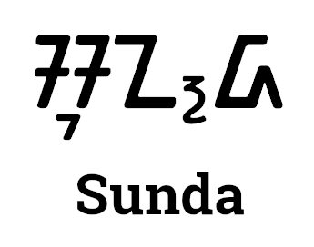

# Sunda Lang

Sunda is a compiled, statically typed and object oriented programming language.

[Sunda is named after the second largest tribe in Indonesia after Java](https://en.wikipedia.org/wiki/Sundanese_people).

By default the language are using garbage collector for memory allocation, but you can still manually allocate memory using the standard library.

- Extension: .sd, .slib
- Paradigm: Imperative, Object Oriented
- Type discipline: Strong typed, statically typed

## License

Licensed under [Apache License](LICENSE)
